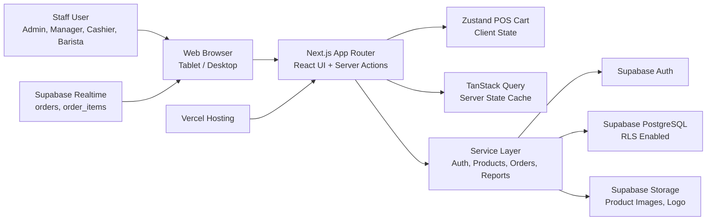
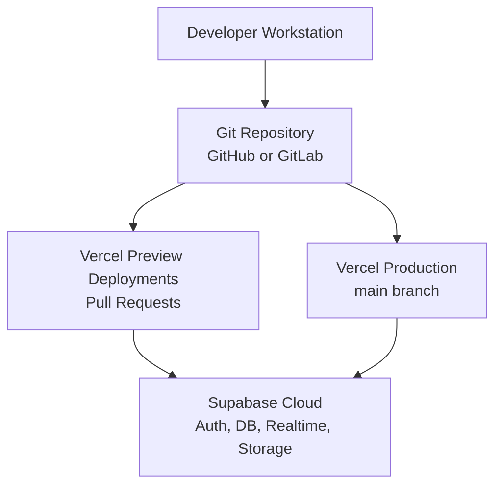
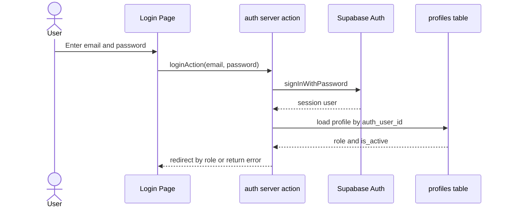
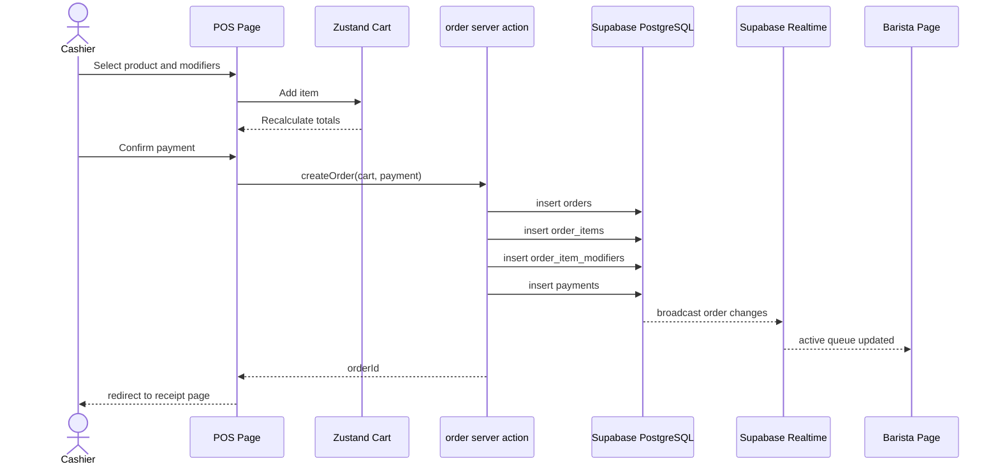
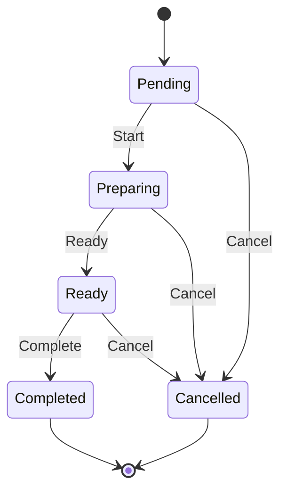
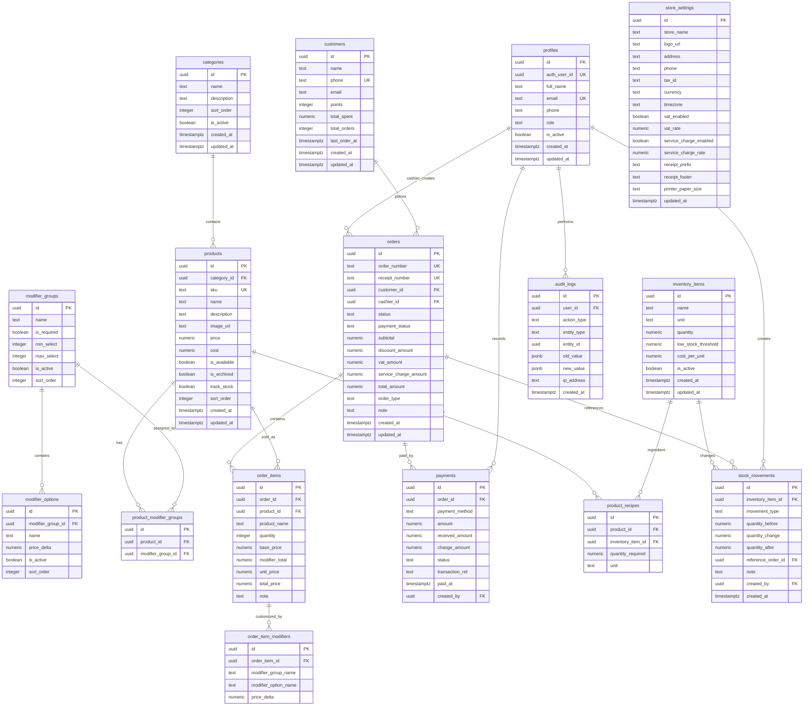

# Coffee POS System Architecture

**Project:** Coffee POS Web Application  
**Document Type:** System Architecture and ER Diagram  
**Version:** 1.0  
**Last Updated:** 2026-05-09  
**Related Documents:**
- `docs/coffee_pos_requirements.md`
- `docs/api_spec.md`
- `docs/superpowers/plans/2026-05-09-coffee-pos-mvp.md`

---

## 1. Architecture Goals

The Coffee POS architecture is designed for fast cashier operation, reliable order persistence, realtime barista updates, role-based access control, and a clean path for future inventory, loyalty, and multi-branch features.

Primary goals:

1. Keep POS UI fast and touch-friendly.
2. Keep payment, order, inventory, and reporting logic outside UI components.
3. Enforce authorization in both application code and Supabase RLS.
4. Use realtime subscriptions for barista queue updates.
5. Keep the MVP small enough to ship, while leaving clear extension points for Phase 2 and Phase 3.

---

## 2. High-Level System Architecture



---

## 3. Application Layers

## 3.1 Presentation Layer

Responsible for UI screens, layouts, forms, loading states, and error states.

Recommended folders:

```text
app/
components/
hooks/
stores/
```

Rules:

- UI components must not contain payment or order persistence logic.
- POS cart can use client state because it is temporary before checkout.
- Pages must enforce role-based access before rendering protected content.
- Forms should use React Hook Form and Zod validation.

## 3.2 Application and Service Layer

Responsible for use cases and business rules.

Recommended folders:

```text
app/actions/
lib/services/
lib/calculations/
lib/validations/
```

Rules:

- `app/actions/*` exposes server actions to UI components.
- `lib/services/*` owns database calls and use-case orchestration.
- `lib/calculations/pos.ts` owns pricing, VAT, service charge, discount, and change calculations.
- `lib/validations/*` owns input validation schemas.

## 3.3 Data Layer

Responsible for Supabase clients, PostgreSQL schema, RLS policies, and seed data.

Recommended folders:

```text
lib/supabase/
supabase/migrations/
supabase/seed.sql
types/database.ts
```

Rules:

- Use browser Supabase client only for safe client-side reads and realtime subscriptions.
- Use server Supabase client for authenticated server actions.
- Use service role client only on the server and only when a trusted operation requires it.
- Never expose `SUPABASE_SERVICE_ROLE_KEY` to the browser.

---

## 4. Deployment Architecture



Required environment variables:

```env
NEXT_PUBLIC_SUPABASE_URL=
NEXT_PUBLIC_SUPABASE_ANON_KEY=
SUPABASE_SERVICE_ROLE_KEY=
NEXT_PUBLIC_APP_URL=
```

---

## 5. Role-Based Access Model

| Role | Main Pages | Key Permissions |
|---|---|---|
| Admin | Dashboard, Products, Orders, Reports, Settings, Staff | Full access, settings, staff, reports, refunds, cancellations |
| Manager | Dashboard, Products, Orders, Inventory, Reports | Store operations, product management, reports, allowed refunds |
| Cashier | POS, Receipt, Own Orders, Customers | Create orders, accept payments, print receipts, suspend/resume orders |
| Barista | Barista Display | View active drink orders and update preparation status |

Authorization must be enforced in two places:

1. Page-level guards in Next.js.
2. Supabase RLS policies in PostgreSQL.

---

## 6. Core Runtime Workflows

## 6.1 Login Flow



## 6.2 POS Checkout Flow



## 6.3 Barista Status Flow



---

## 7. ER Diagram

This ER diagram covers the full requirement set, including MVP and Phase 2 entities. MVP implementation can start with the tables marked as MVP.



---

## 8. Table Ownership by Phase

| Phase | Tables |
|---|---|
| MVP | `profiles`, `categories`, `products`, `modifier_groups`, `modifier_options`, `product_modifier_groups`, `orders`, `order_items`, `order_item_modifiers`, `payments`, `store_settings` |
| Phase 2 | `inventory_items`, `product_recipes`, `stock_movements`, `customers`, `audit_logs` |
| Phase 3 | Add `branches`, `online_orders`, `delivery_integrations`, `promotions`, `membership_tiers` |

---

## 9. Realtime Design

Realtime subscriptions:

| Channel | Tables | Used By | Purpose |
|---|---|---|---|
| `barista-orders` | `orders`, `order_items`, `order_item_modifiers` | Barista Display | Show paid orders and status changes |
| `order-status` | `orders` | POS, Orders Detail | Update cashier when order status changes |

Rules:

- Subscribe only after user is authenticated.
- Barista page should filter active statuses: `pending`, `preparing`, `ready`.
- Completed and cancelled orders should be removed from the active barista board.
- If realtime disconnects, show a warning and allow manual refresh.

---

## 10. Security Architecture

Security controls:

1. Supabase Auth manages identity.
2. `profiles` maps Supabase auth users to application roles.
3. Next.js protected layouts guard page access.
4. RLS protects table access.
5. Server actions validate all inputs with Zod.
6. Service role key is used only server-side.
7. Sensitive actions create audit logs in Phase 2.

RLS examples:

| Rule | Enforcement |
|---|---|
| Cashier can read own orders | `orders.cashier_id = current_profile_id()` |
| Manager and Admin can read all orders | role in `admin`, `manager` |
| Barista can read active paid orders | role in `barista`, `manager`, `admin` |
| Only Admin can manage staff | `profiles` write policy |
| Only Manager and Admin can manage products | `products` write policy |

---

## 11. Failure Handling

| Failure | Expected Behavior |
|---|---|
| Network disconnected at POS | Show warning and block final payment confirmation |
| Order save fails | Do not create paid order, show actionable error |
| Payment save fails | Order must not be marked as paid |
| Realtime disconnected | Show reconnect warning and allow refresh |
| Receipt print fails | Keep order saved and allow reprint |
| Unauthorized access | Redirect to allowed home page or show access denied |

