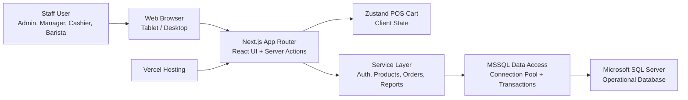
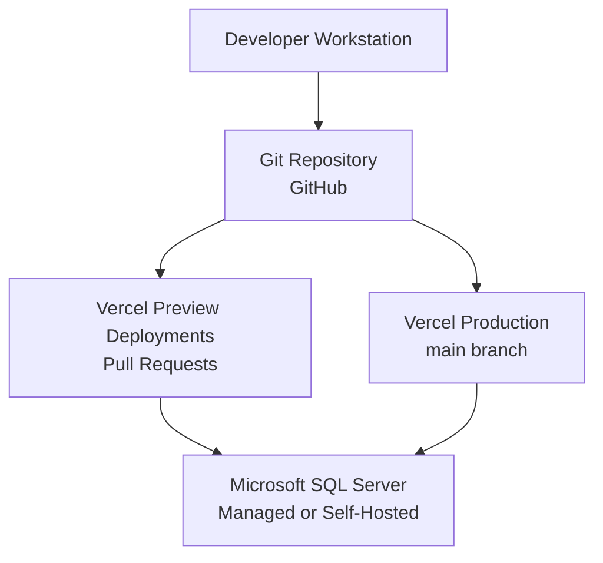
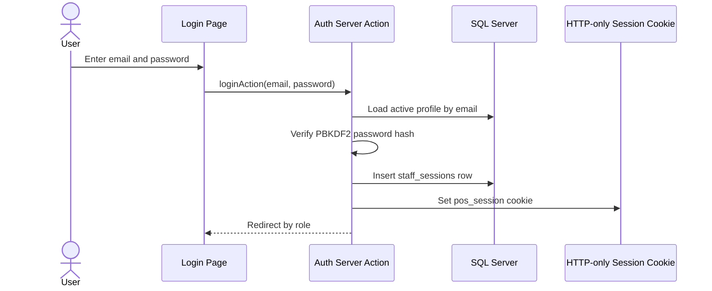
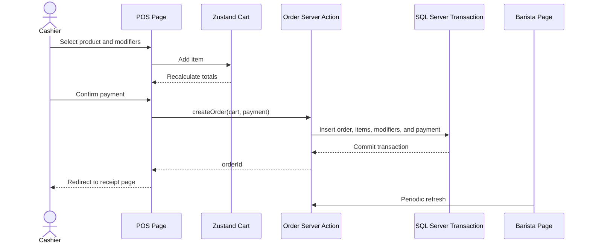
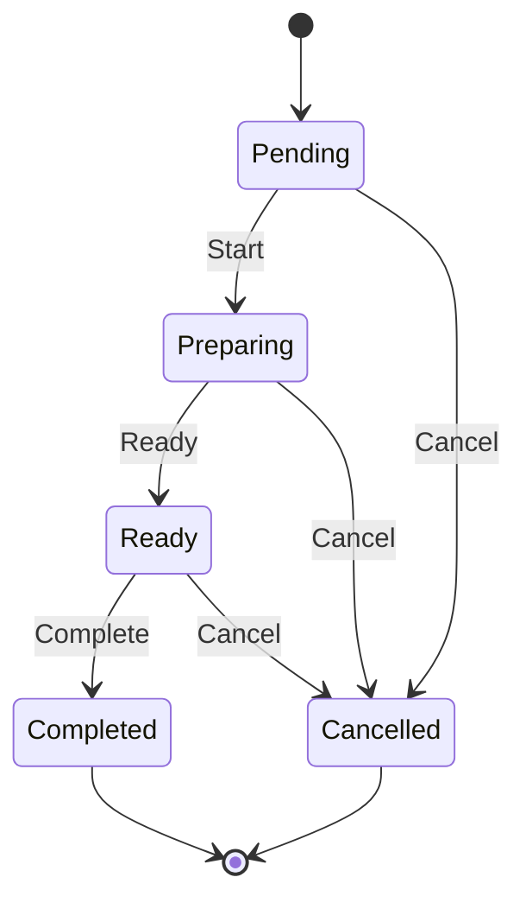
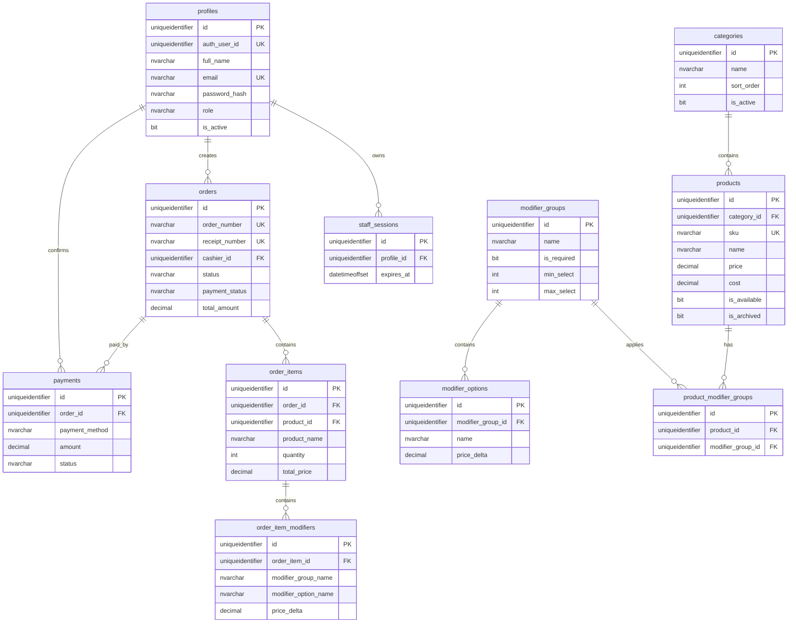

# Coffee POS System Architecture

**Project:** Coffee POS Web Application  
**Document Type:** System Architecture and ER Diagram  
**Version:** 2.0  
**Last Updated:** 2026-05-09  

## 1. Architecture Goals

The Coffee POS architecture is designed for fast cashier operation, reliable order persistence, live barista queue refresh, role-based access control, and a clean path for future inventory, loyalty, and multi-branch features.

Primary goals:

1. Keep POS UI fast and touch-friendly.
2. Keep payment, order, inventory, and reporting logic outside UI components.
3. Use Microsoft SQL Server as the system of record.
4. Enforce authorization in service functions and protected layouts.
5. Use HTTP-only session cookies for staff sessions.
6. Keep the MVP small enough to ship while leaving extension points for Phase 2 and Phase 3.

## 2. High-Level Architecture



## 3. Application Layers

### 3.1 Presentation Layer

Responsible for screens, layouts, forms, loading states, and error states.

Primary folders:

```text
frontend/app/
frontend/components/
frontend/hooks/
frontend/stores/
```

Rules:

- UI components must not contain payment or order persistence logic.
- POS cart state is client-side and temporary before checkout.
- Protected pages must enforce role-based access before rendering.
- Forms should use Zod validation and server actions.

### 3.2 Application and Service Layer

Responsible for use cases and business rules.

Primary folders:

```text
backend/actions/
backend/services/
backend/calculations/
backend/validations/
backend/auth/
```

Rules:

- `backend/actions/*` exposes server actions to UI components.
- `backend/services/*` owns database calls and use-case orchestration.
- `backend/calculations/pos.ts` owns pricing, VAT, service charge, discount, and change calculations.
- `backend/auth/*` owns password verification and HTTP-only session cookies.

### 3.3 Data Layer

Responsible for SQL Server connection pooling, transactions, schema, and seed data.

Primary folders:

```text
backend/mssql/
database/mssql/schema.sql
database/mssql/seed.sql
shared/types/database.ts
```

Rules:

- SQL Server access must happen only on the server.
- Mutations that create orders, order items, modifiers, and payments must use transactions.
- Secrets must stay in server-only environment variables.
- Browser code must never receive database credentials.

## 4. Deployment Architecture



Required environment variables:

```env
NEXT_PUBLIC_APP_URL=
MSSQL_CONNECTION_STRING=
MSSQL_SERVER=
MSSQL_PORT=
MSSQL_DATABASE=
MSSQL_USER=
MSSQL_PASSWORD=
MSSQL_ENCRYPT=
MSSQL_TRUST_SERVER_CERTIFICATE=
MSSQL_POOL_MAX=
```

## 5. Role-Based Access Model

| Role | Main Pages | Key Permissions |
| --- | --- | --- |
| Admin | Dashboard, Products, Orders, Reports, Settings, Staff | Full access, settings, staff, reports, refunds, cancellations |
| Manager | Dashboard, Products, Orders, Inventory, Reports | Store operations, product management, reports, allowed refunds |
| Cashier | POS, Receipt, Own Orders, Customers | Create orders, accept payments, print receipts, suspend/resume orders |
| Barista | Barista Display | View active drink orders and update preparation status |

Authorization is enforced in:

1. Protected layouts and role guards.
2. Server actions.
3. Service functions before sensitive data access.

## 6. Core Runtime Workflows

### 6.1 Login Flow



### 6.2 POS Checkout Flow



### 6.3 Barista Status Flow



## 7. ER Diagram



## 8. Live Queue Design

The MVP uses periodic refresh on the barista board. This avoids direct browser database access and keeps SQL Server credentials server-only.

Current behavior:

- The barista board refreshes every 5 seconds.
- Queue data is loaded through server-rendered data and server actions.
- Future versions can add SignalR, WebSocket fan-out, or a message broker if true push updates are required.

## 9. Security Notes

- Passwords are stored as PBKDF2 hashes.
- Staff sessions are stored in `staff_sessions` and referenced by an HTTP-only cookie.
- SQL Server credentials are server-only environment variables.
- Service functions enforce role checks before sensitive operations.
- Production SQL users should use least-privilege permissions.
